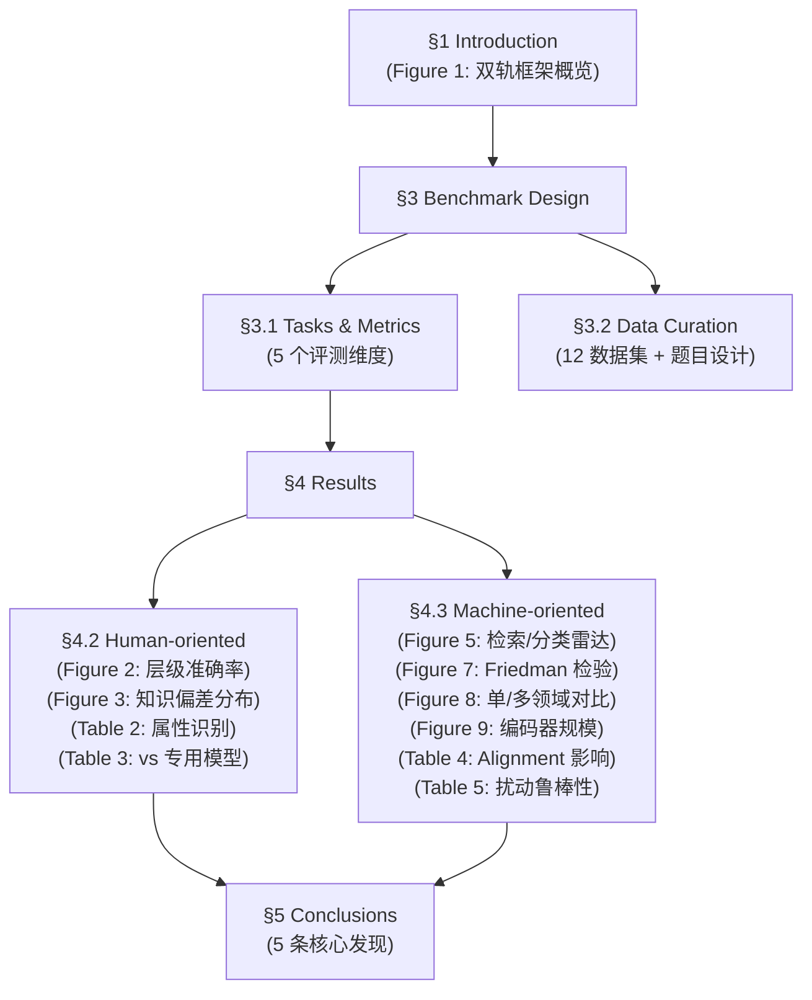

# FG-BMK 完整网站架构规划

基于论文 (arXiv:2504.14988) 的完整结构推导出的网站架构。

## 论文结构 → 网站映射

## 当前状态 vs 目标状态

| 当前（已完成） | 目标（完整架构） | 需要的素材 |
|:---|:---|:---|
| ✅ Hero 区 | ✅ 保持 | — |
| ✅ 亮点卡片 (3 cards) | ✅ 保持 | — |
| ✅ 数据集标签 | ✅ 保持 | — |
| ✅ Abstract | ✅ 保持 | — |
| ✅ Evaluation Framework + Figure 1 | ✅ 保持 | — |
| ❌ 缺失 | **Key Findings (核心发现)** | 论文 §4.2 + §4.3 结论 |
| ✅ 雷达图 (已有) | **Human-oriented Results** | Figure 2, Figure 3, Table 2, Table 3 |
| ❌ 缺失 | **Machine-oriented Results** | Figure 5, Figure 7, Figure 8, Figure 9, Table 4, Table 5 |
| ✅ Leaderboard (占位) | **交互式 Leaderboard** | 各模型完整分数 |
| ✅ BibTeX | ✅ 保持 | — |

---

## 目标架构（从上到下）

### 1. Hero 区 ✅ 已完成
标题、作者、链接。

### 2. Highlights Dashboard ✅ 已完成
三张卡片：规模、双范式、细粒度。

### 3. Dataset Composition ✅ 已完成
12 个数据集标签。

### 4. Abstract ✅ 已完成

### 5. Evaluation Framework ✅ 已完成
双轨框架 + Figure 1。

---

### 6. 🆕 Key Findings（核心发现总览）

> 论文 §4 的 **5 条粗体结论** 浓缩展示。

这是论文最高价值的内容，应该在具体图表之前给出全貌。建议用**带序号的卡片**或**时间轴**风格，每条发现配一句话摘要：

| # | Finding | 论文来源 |
|---|---------|--------|
| 1 | LVLMs 无法区分过于细粒度的类别 | §4.2, Figure 2 |
| 2 | 不同类别的识别准确率严重不一致（知识偏差） | §4.2, Figure 3 |
| 3 | 对比训练范式显著优于生成/重建范式 | §4.3, Figure 5/7 |
| 4 | Alignment 策略会**损害**视觉特征的判别力 | §4.3, Table 4 |
| 5 | 视觉特征在细粒度任务中更易受扰动影响 | §4.3, Table 5 |

**素材**：纯文字，无需图片。

---

### 7. 🆕 Human-oriented Results（人类导向实验结果）

展示论文 §4.2 中的三组实验。

| 子板块 | 内容 | 需要的图/表 |
|--------|------|------------|
| **层级粒度** | 随粒度递减，准确率骤降 (Class→Genus→Species) | **Figure 2**（折线图/柱状图） |
| **知识偏差** | 各类别准确率排名，暴露模型偏见 | **Figure 3**（逐类别准确率分布图） |
| **属性识别** | 颜色/形状/纹理等属性的识别准确率 | **Table 2**（属性准确率表格） |

**也可选展示**：Table 3（vs 专用细粒度模型对比）。

> [!IMPORTANT]
> 雷达图（目前的 sec4_rader_cls.png / sec4_rader_retri.png）实际上属于 **Machine-oriented** 的 Figure 5，应该移到下一个板块中。

---

### 8. 🆕 Machine-oriented Results（机器导向实验结果）

展示论文 §4.3 中的核心实验。

| 子板块 | 内容 | 需要的图/表 |
|--------|------|------------|
| **检索 + 分类性能** | 12 模型在各数据集上的雷达图对比 | **Figure 5**（即当前已有的雷达图） |
| **统计检验** | Friedman + Nemenyi 检验，证明差异显著 | **Figure 7** |
| **单/多领域对比** | 单一训练 vs 混合训练的准确率变化 | **Figure 8**（即用户截图的折线图） |
| **编码器规模** | 更大编码器 ≠ 更高细粒度判别力 | **Figure 9** |
| **Alignment 影响** | 原始 vs 对齐特征的分类准确率 | **Table 4** |
| **扰动鲁棒性** | 细粒度任务比通用任务更脆弱 | **Table 5** |

---

### 9. 🏆 Interactive Leaderboard（交互式排行榜）

参考 MMMU 截图的风格，未来做成可排序、可筛选的交互表格。当前先用静态表格占位。

---

### 10. BibTeX ✅ 已完成

---

## 需要向师兄索要的素材清单

| 优先级 | 素材 | 论文位置 | 用途 |
|--------|------|---------|------|
| 🔴 高 | Figure 2 (层级粒度准确率图) | §4.2 | Human-oriented Results |
| 🔴 高 | Figure 3 (知识偏差分布图) | §4.2 | Human-oriented Results |
| 🔴 高 | Table 2 (属性识别准确率) | §4.2 | Human-oriented Results / Leaderboard |
| 🔴 高 | Table 3 (vs 专用模型对比) | §4.2 | Leaderboard |
| 🟡 中 | Figure 7 (Friedman 检验) | §4.3 | Machine-oriented Results |
| 🟡 中 | Figure 8 (单/多领域折线图) | §4.3 | Machine-oriented Results |
| 🟡 中 | Figure 9 (编码器规模影响) | §4.3 | Machine-oriented Results |
| 🟡 中 | Table 4 (Alignment 影响) | §4.3 | Machine-oriented Results |
| 🟡 中 | Table 5 (扰动鲁棒性) | §4.3 | Machine-oriented Results |
| 🟢 低 | 各模型完整分数数据 | 全文 | Interactive Leaderboard |

---

## 立即可做（无需新素材）

1. **Key Findings 板块**：纯文字，从论文 5 条结论直接提炼
2. **雷达图归位**：将现有雷达图从当前位置移入 "Machine-oriented Results"
3. **Leaderboard 框架搭建**：当前静态表格保留，后续升级为交互式
